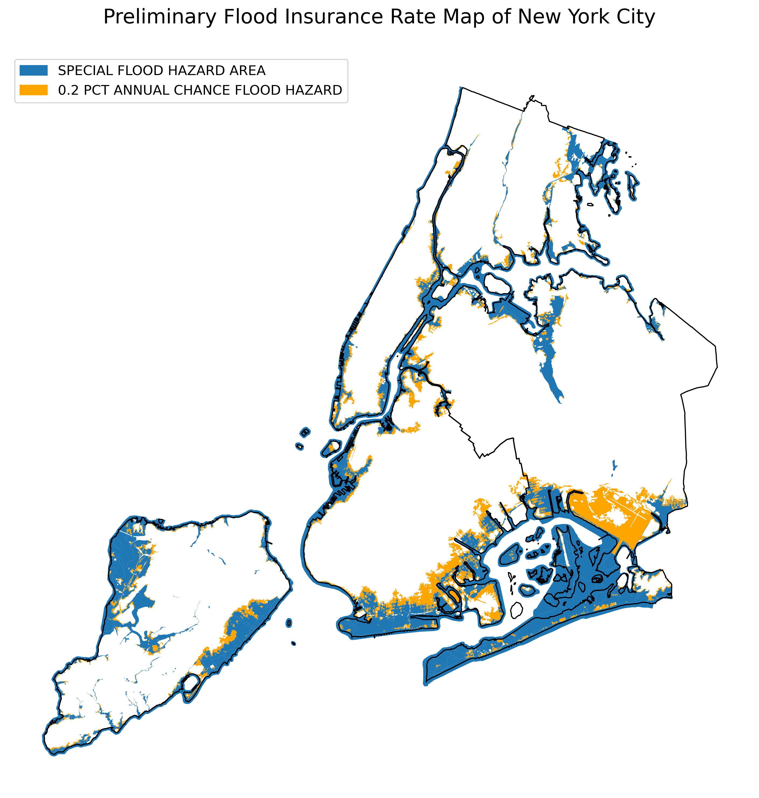

### New York City's Preliminary Flood Insurance Rate Map (PFIRM) Data Analysis

Author: Mark Bauer

I've wanted to do this project for some time now, and I'm finally happy to share this open source project. This notebook demonstrates how to analyze FEMA's Preliminary Flood Insurance Rate Map (i.e. PFIRM), sometimes known as *flood zone*. The flood zone is for New York City (i.e. all five boroughs). Let's see what cool things we can discover about this dataset!

Jupyter Notebook:  
Kindly find the analysis in the [floodzone-pfirm-analysis.ipynb](https://github.com/mebauer/nyc-floodzone-analysis/blob/master/floodzone-pfirm-analysis.ipynb) notebook in this repository.

MyBinder:  
You can run an interactive notebook on MyBinder - preferably Google Chrome:  .  
Note: When the page loads, click on the file *floodzone-pfirm-analysis.ipynb* on the left-hand side.

Kaggle:  
The notebook can be accessed on Kaggle: [NYC's Flood Zone Exploratory Data Analysis](https://www.kaggle.com/mebauer/nyc-s-flood-zone-exploratory-data-analysis). 

Contact information:

Twitter: [markbauerwater](https://twitter.com/markbauerwater)  
LinkedIn: [markebauer](https://www.linkedin.com/in/markebauer/)  
GitHub: [mebauer](https://github.com/mebauer)

*Keywords:* FEMA, Flood Insurance Rate Map, FIRM, National Flood Hazard Layer, NFHL, National Flood Insurance Program, NFIP, Flood, Flood Zone, Flood Map, New York City, NYC, Python, pandas, GeoPandas, GIS, Open Source

