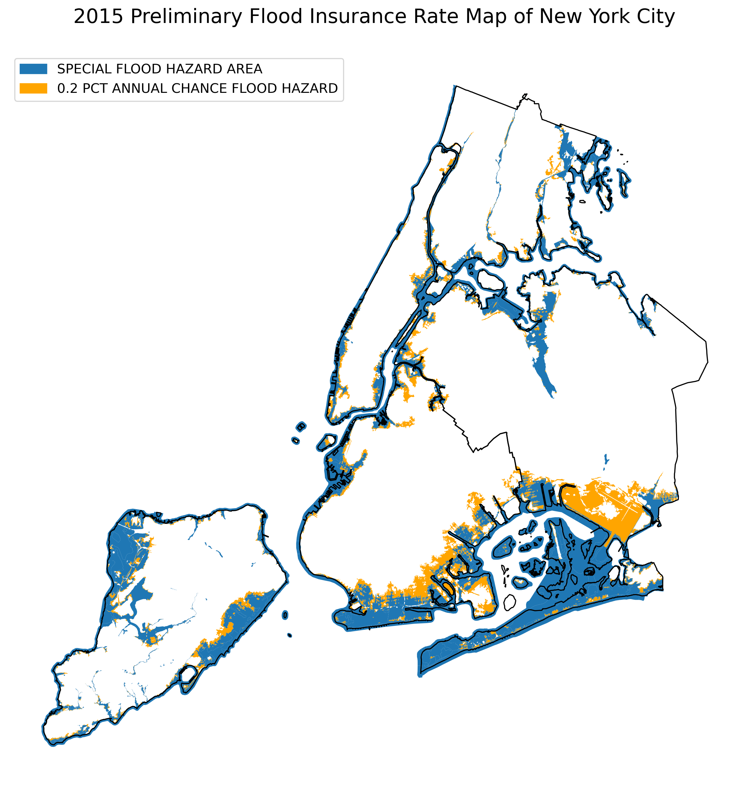

# Exploring FEMA's Preliminary Flood Insurance Rate Map (PFIRM) For NYC Using Python

Author: Mark Bauer

# 1. Introduction
This notebook demonstrates how to analyze FEMA's Preliminary Flood Insurance Rate Map (i.e. PFIRM) with Python. The PFIRM is for New York City.

# 2. Notebook 
- You can find the exploratory data analysis in the [exploratory-analysis.ipynb](https://github.com/mebauer/nyc-floodzone-analysis/blob/master/exploratory-analysis.ipynb) notebook.
- To inspect how to download the data, please see the [download-data.ipynb](https://github.com/mebauer/nyc-floodzone-analysis/blob/master/download-data.ipynb) notebook.

# 3. Data
The Preliminary Flood Insurance Rate Map (PFIRM) source data for NYC was downloaded from FEMA's [Region 2 Coastal Analysis and Mapping](https://r2-coastal-fema.hub.arcgis.com/pages/preliminary-flood-map-data) data page.

# 4. Say Hello!
Feel free to reach out.
- LinkedIn: [markebauer](https://www.linkedin.com/in/markebauer/)   
- Portfolio: [mebauer.github.io](https://mebauer.github.io/)
- GitHub: [mebauer](https://github.com/mebauer)

*Keywords:* FEMA, Flood Insurance Rate Map, FIRM, National Flood Hazard Layer, NFHL, National Flood Insurance Program, NFIP, Flood, Flood Zone, Flood Map, New York City, NYC, Python, pandas, GeoPandas, GIS, Open Source